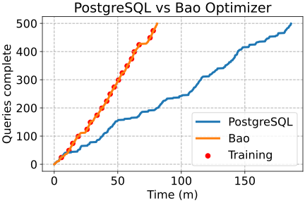
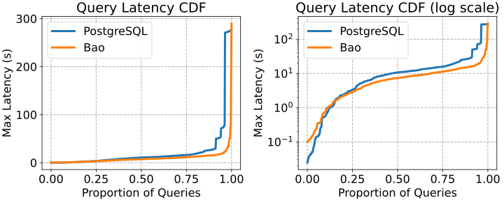

# Analyzing the executions

With logs of our saved runs in `bao_run.txt` and `pg_run.txt`, we can next analyze them. If you are using the VM, you can move these files to `/vagrant/` to access them from outside the VM.

To analyze the logs, run the `analyze_bao.ipynb` Python notebook. Make sure `bao_run.txt` and `pg_run.txt` are in the same folder. You'll need [Jupyter](https://jupyter.org/) to run the notebook if you don't already have it. 

The notebook will first generate a queries complete vs. time graph. Depending on your hardware, the results will vary. Below is what I saw on my hardware:

The graph shows the number of queries that have been completed since the start of the experiment, *including the training time of Bao*. Each red circle indicates a time when query execution was paused and the Bao model was trained. Obviously, when deployed, one does not have to pause query execution to retrain the Bao model, and this retraining can either be offloaded to another machine or done at a fixed time during the day, concurrent with query processing. On my hardware, Bao executed the example workload about twice as fast as the default PostgreSQL optimizer. 

Where do Bao's gains come from? Finishing the workload faster could come from making every query a little faster, or making a few queries much faster. To examine this, we look at the CDF of query times, which is the next pair of graphs generated by the notebook.

The left figure shows the CDF with a linear y-axis, whereas the right figure shows the same CDF with a log scale. We can see that the majority of Bao's gains come from decreasing latency "at the tail" of the distribution: the 90%, 95%, etc. Bao incurs a slightly longer longest-running query (best visible on the left plot), and increases the query time of the fastest queries slightly (best visible on the right plot).

Bao increases the latency of the fastest query by a small margin because of increased optimization time. This is because query planning with Bao requires executing the PostgreSQL planner several times, and running inference through a neural network. If you care about a particular query taking 0.01 seconds instead of 0.05 seconds, you can always disable Bao on a per-query basis.

What about query regressions? The next table shows the latency of each query when using the PostgreSQL optimizer, and the worst / best time achieved by Bao.

{{#include table.html}}

We can see immediately that Bao has huge gains on Q1, which takes almost 5 minutes for PostgreSQL to process. However, on Q2 and Q3, while Bao normally found a pretty good plan (the Bao best column), sometimes Bao picked a regressing plan that took significantly longer to execute than the PostgreSQL plan. 

For some applications, the raw workload speedup achieved by Bao may be more important than any of these query regressions. For other applications, these query regressions may be a huge problem. Next, we discuss how to use Bao's exploration mode to avoid these regressions.
