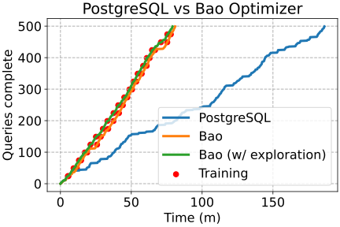
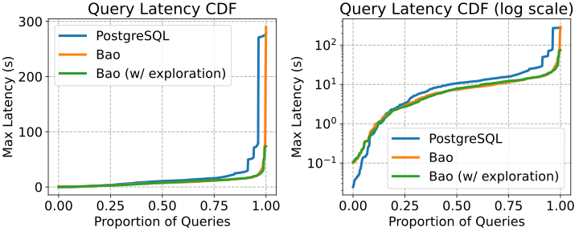

# Analyze the workload with exploration mode

We'll use [the same notebook as before](./3_2_analyze_workload.md) to analyze our new `bao_with_regblock.txt` results. You'll need to change the `SHOW_RG = False` line in the 2nd cell to `SHOW_RG = True` to plot both our previous run (without exploration mode) and our new run.

First, we'll look at queries completed vs. time.

The new green line shows the performance of Bao with our three test queries entered into experimental mode. In terms of overall workload performance, exploration mode doesn't help all tha tmuch: the workload finishes only a little bit faster.

Next, we'll look at the query latency CDFs.

The green line shows that tail latency has been significantly reduced, which is accounted for almost entirely by avoiding a few regressing query plans. We can verify this with the same table we looked at before:

{{#include table_rg.html}}

The first column shows the latency from the query plans produced by the  PostgreSQL optimizer. The next two columns show the latency from the query plans produced Bao optimizer. The final two columns show our new results, the latency from the query plans produced by the Bao optimizer with exploration mode.

The large regressions on query 2 and 3 are eliminated, with both having a much more reasonble worst case time.

